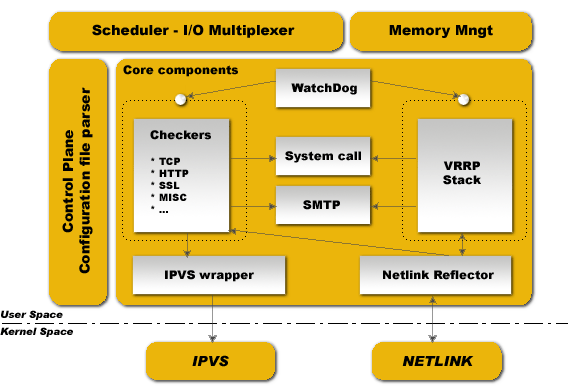

软件设计
^^^^^^^^

Keepalived是用纯ANSI/ISO C编写的。该软件围绕一个中央I/O多路复用器进行连接，以提供实时网络设计。\
主要的设计重点是在所有元素之间提供同质的模块化。这就是创建核心库来删除重复代码的原因。\
目标是生成安全可靠的代码，确保生产的健壮性和稳定性。

为了确保健壮性和稳定性，守护进程被切分为3个不同进程：

* 一个极简的父进程，负责fork和监控子进程

* 两个子进程，一个负责VRRP框架，另一个负责健康检查

每个子进程都有自己的调度I/O多路复用器，这种方式优化了VRRP调度抖动，因为VRRP调度比健康检查更敏感/关键。\
这种拆分设计最小化了健康检查依赖库的使用，并将其自己的操作最小化到空闲主循环，以避免由自身引起的故障。

父进程监控框架称为watchdog，设计是每个子进程打开一个accept unix域套接字，然后在守护进程引导时，\
父进程连接到那些unix域套接字并向子进程发送周期性(5秒)的hello数据包。\
如果父进程无法向远程连接的unix域套接字发送hello数据包，则只需重启子进程。

这种看门狗设计提供了2个好处，首先从父进程发送到远程连接子进程的hello数据包是通过I/O多路复用器调度程序完成的，\
它可以检测子进程调度框架中的deadloop。第二个好处是通过使用sysV信号来检测死亡的子进程。运行时，您将看到如下的进程列表：::

    PID    111    Keepalived        < - 监视子进程的父进程
           112    \ _ Keepalived    < - VRRP子进程
           113    \ _ Keepalived    < - 健康检查子进程

内核组件
--------

Keepalived使用了4个Linux内核组件：

1. LVS框架：使用getsockopt和setsockopt调用来获取和设置套接字上的选项

2. Netfilter框架：支持NAT和Masquerading的IPVS代码

3. Netlink接口：在网络接口上设置和删除VRRP虚拟IP

4. 组播：VRRP通告发送到保留的VRRP组播组(224.0.0.18)

原子元素
--------

控制平面
--------

Keepalived配置通过keepalived.conf文件完成。一个编译器设计用于解析。\
解析器使用关键字树层次结构来使用特定处理器映射每个配置关键字。\
中央多级递归函数读取配置文件并遍历关键字树。在解析期间，配置文件被转换为内部的内存表示。

调度程序-I/O多路复用器
----------------------

所有事件都相同过程中进行调度。Keepalived是一个单一的过程。Keepalived是一个网络路由软件，它是如此地接近I/O。\
这里使用的设计是一个中央的select(...)，负责调度所有内部任务。\
该框架提供了自己的线程抽象，针对网络目的进行了优化，没有使用POSIX线程库。

内存管理
--------

此框架提供了对一些通用内存管理方法的访问，如allocation、reallocation和release等。\
此框架可用于两种模式：normal_mode和debug_mode。当使用debug_mode时，它提供了一种消除和跟踪内存泄露的强大方式。\
这种底层环境通过跟踪内存分配和释放来提供缓冲区欠载保护。使用的所有缓冲区都是固定长度的，以防止最终的缓冲区溢出。

核心组件
--------

此框架定义了所有代码中使用的一些通用和全局库。这些库是：html解析，链表，定时器，向量，格式化字符串，缓冲区转储，\
网络工具，守护进程管理，pid处理，低级别4层TCP。这里的目标是尽可能地分解代码，以限制过多的冗余代码和增加模块化。

WatchDog
--------

此框架提供子进程监控（VRRP和健康检查）。每个子进程都接受到自己的监视器unix域套接字的连接。\
父进程向子进程的该unix域套接字发送hello数据包。Hello数据包使用父进程的I/O多路复用器发送，\
并使用子进程的I/O多路复用器接收/处理。如果父进程检测到断开的管道，它将使用sysV信号测试子进程是否存活并重新启动子进程。

检查器
------

这是Keepalived的主要功能之一。检查器负责真实服务器的健康检测。检查器测试真实服务器是否处于活动状态，\
此测试以二元的决策结束：从LVS拓扑中移除或添加真实服务器。检查器内部设计为实时网络软件，\
它使用完全多线程的FSM（有限状态机）设计。此检查器堆栈提供对应4层到5/7层测试结果的LVS拓扑操作。它在由父进程监控的独立子进程中运行。

VRRP堆栈
--------

Keepalived的另一个重要功能。VRRP（虚拟路由器冗余协议：RFC2338）专注于导向器接管，它为路由器备份提供底层设计。\
它实现了完整的IETF RFC2338标准，其中包含为LVS和防火墙设计的一些规定和扩展。它实现了vrrp_sync_group扩展，可在协议接管后保证持久性路由路径。\
它使用MD5-96bit加密配置实现IPSEC-AH，以提供安全的协议通告交换。有关VRRP的更多信息，请阅读RFC。\
一个重要的事情就是：VRRP代码被设计为独立使用，因此可以在没有LVS支持的情况下工作。它在由父进程监控的独立子进程中运行。

系统调用
--------

此框架提供了运行额外系统脚本的能力。它主要用于MISC检查器。在VRRP框架中，它提供了在协议状态转换期间启动额外脚本的能力。\
系统调用通过fork子进程来进行，以便不会扰乱全局调度定时器。

Netlink反射器
-------------

和IPVS封装器相同。Keepalived使用自己的网络接口表示。通过内核Netlink通道设置和监控IP地址和接口标志。\
Netlink消息子系统用于设置VRRP VIP。另一方面，Netlink内核消息广播功能用于将与接口相关的任何事件反映到我们的用户空间Keepalived内部数据表示中。\
因此，任何其他用户空间（其他程序）的Netlink操作都会通过Netlink内核广播（RTMGRP_LINK & RTMGRP_IPV4_IFADDR）反映到我们的Keepalived数据表示中。

SMTP
----

SMTP协议用于管理通知。它使用多线程FSM设计实现了IEFT RFC821。在健康检查活动和VRRP协议状态转换时进行管理通知。\
SMTP协议是很常用的，因此可以与任何其他通知子系统对接，如GSM-SMS，寻呼机等。

IPVS封装器
----------

此框架用于将规则发送到内核IPVS代码。它提供Keepalived内部数据表示和IPVS rule_user表示之间的转换。它使用IPVS libipvs来保持与IPVS代码的通用集成。

IPVS
----

来自Wensong的LinuxVirtualServer.org开源项目提供的Linux内核代码。IPVS（IP Virtual Server）在Linux内核中实现传输层负载均衡，也称为第4层交换。

NETLINK
-------

由Alexey Kuznetov 提供的Linux内核代码，具有非常好的高级路由框架和子系统功能。Netlink用于在内核和用户空间进程之间传输消息。\
它由用于用户空间进程的标准套接字接口和用于内核模块的内部内核API组成。

Syslog
------

所有的Keepalived守护进程通知消通过syslog服务进行记录。

健康检查框架
------------

每个健康检查都注册到全局调度框架。这些健康检查工作线程实现了以下类型的运行状况检查：

**TCP_CHECK**

    工作在4层。为确保检查，我们通过非阻塞/带超时时间的TCP连接进行常规检查。如果远程服务器未回复此请求（超时），则测试错误，服务器将从服务器池中移除。

**HTTP_GET**

    工作在5层。对指定的URL执行HTTP GET。然后使用MD5算法对HTTP GET结果进行求和。如果此总和与预期值不匹配，则测试错误，服务器将从服务器池中移除。\
    此模块实现了对同一服务的多URL get检查。如果您使用的服务器托管了多个应用服务，则此功能非常有用。此功能使您能检查应用服务是否正常运行。\
    MD5摘要使用gethash工具（包含在Keepalived包中）生成。

**SSL_GET**

    与HTTP_GET相同，但使用SSL连接到远程Web服务器。

**MISC_CHECK**

    此检查允许用户定义的脚本作为运行状况检查程序运行。结果必须为0或1。脚本在导向器内运行，这是测试内部应用程序的理想方法。\
    可以使用完整路径（例如/path_to_script/script.sh）调用不带参数的运行脚本。那些需要参数的必须用双引号括起来（例如“/path_to_script/script.sh arg 1 ... arg n ”）

Keepalived的目标是定义一个易于扩展的通用框架，用于添加新的检查器模块。如果您对现有的检查器的开发感兴趣，请查看源代码中的keepalived/check目录：

    https://github.com/acassen/keepalived/tree/master/keepalived/check

故障切换（VRRP）框架
--------------------

Keepalived实现了用于导向器故障切换的VRRP协议。在实现的VRRP堆栈中，VRRP数据包调度程序负责为每个VRRP实例多路分发特定的I/O。

在RFC2338中，VRRP被定义为：::

    VRRP指定一个选举协议，负责动态分配虚拟路由器到LAN上的一个VRRP路由器。\
    控制与虚拟路由器关联的IP地址的VRRP路由器称为Master（主路由器），对发送到这些IP地址的数据包进行转发。\
    当Master不可用时，选举过程提供转发责任的动态故障切换。
    这允许终端主机将LAN上任何的虚拟路由器IP地址作为默认的第一跳路由器。
    使用VRRP的优点就是，无需在每个终端主机上配置动态路由或路由发现协议，就可以获得更高可用性的默认路径。[rfc2338]

::

    注意
    该框架与LVS无关，因此您可以将其用于LVS路由器故障切换，即使对于其他需要热备用协议的Linux路由器也是如此。\
    出于设计和健壮性原因，此框架已经完全集成在Keepalived守护进程中。

该框架提供的主要功能是：

* 故障切换：原生的VRRP协议意图，基于漫游的VRRP VIP集；

* VRRP实例同步：我们可以指定2个VRRP实例之间的状态监控，也称为VRRP同步组。它保证2个VRRP实例保持相同状态，同步实例间相互监视；

* 漂亮的回退

* 通告数据包完整性：使用使用IPSEC-AH ICV；

* 系统调用：在VRRP状态转换期间，可以调用外部脚本/程序。
